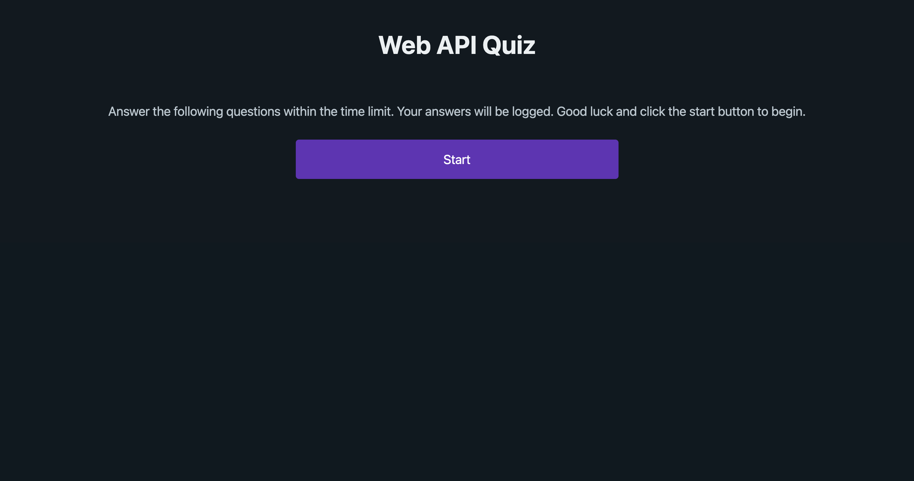

# web-api-quiz

## Description

A timed quiz on JavaScript fundamentals that stores high scores and gauges my progress compared to my peers.

- My motivation for this project was to create a timed quiz that was quick and easy.
- I built this project to test the skills and knowledge of my peers.
- Due to localStorage, it solves the problem of having to manually grade.
- I learned that localStorage is extremely important to the functionality of many website and webapps.

## Table of Contents (Optional)

If your README is long, add a table of contents to make it easy for users to find what they need.

- [Installation](#installation)
- [Usage](#usage)
- [Credits](#credits)
- [License](#license)

## Installation

N/A

## Usage

In order to use, click the buttons to proceed through the quiz.

## Credits

https://en.wikipedia.org/wiki/Web_API

https://www.ibm.com/topics/api

https://developer.mozilla.org/en-US/docs/Web/API

https://www.w3schools.com/

https://www.picocss.com

Xpert Learning Assistant

## License

Copyright (c) 2023 Jesse Howell

Permission is hereby granted, free of charge, to any person obtaining a copy
of this software and associated documentation files (the "Software"), to deal
in the Software without restriction, including without limitation the rights
to use, copy, modify, merge, publish, distribute, sublicense, and/or sell
copies of the Software, and to permit persons to whom the Software is
furnished to do so, subject to the following conditions:

The above copyright notice and this permission notice shall be included in all
copies or substantial portions of the Software.

THE SOFTWARE IS PROVIDED "AS IS", WITHOUT WARRANTY OF ANY KIND, EXPRESS OR
IMPLIED, INCLUDING BUT NOT LIMITED TO THE WARRANTIES OF MERCHANTABILITY,
FITNESS FOR A PARTICULAR PURPOSE AND NONINFRINGEMENT. IN NO EVENT SHALL THE
AUTHORS OR COPYRIGHT HOLDERS BE LIABLE FOR ANY CLAIM, DAMAGES OR OTHER
LIABILITY, WHETHER IN AN ACTION OF CONTRACT, TORT OR OTHERWISE, ARISING FROM,
OUT OF OR IN CONNECTION WITH THE SOFTWARE OR THE USE OR OTHER DEALINGS IN THE
SOFTWARE.

## Badges

N/A

## Features

N/A

## How to Contribute

N/A

## Tests

N/A

[Live URL](https://jesse-howell.github.io/web-api-quiz/)